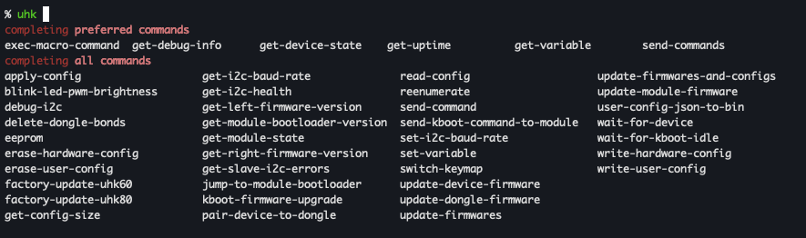

Repo to interact with an Ultimate Hacking Keyboard via USB commands. Mainly used to notify on end of long running tasks, or upcoming meetings.

# INSTALL

```bash
unzip agent-*.zip
ln -s /path/to/uhk.sh ~/.local/bin/uhk
ln -s /path/to/uhk.completion.zsh ~/.local/share/zsh/completions/
uhk [tab]
```




# USAGE

```bash
uhk get-uptime
uhk exec-macro-command 'setLedTxt 1000 abc'
uhk exec-macro-command 'exec Blink-RED'
```

# MISC

## Macros

The `exec-macro-command` supports at most 61 characters. For longer macros you have to save it on the keyboard, and then execute via `exec <uhk macro name>` (see example usage and [macros folder](./macros)).

## minimising node_modules folders
to trace module import & requires of a script (to minimise the agent folder), use:

```bash
node \
  --require ./utils/cjs-trace.cjs \
  --loader ./utils/trace-loader.mjs \
  --no-warnings=ExperimentalWarning \
  yourScript.ts

# or usinge `mise`
mise exec -- node --require ./utils/cjs-trace.cjs --loader ./utils/trace-loader.mjs --no-warnings=ExperimentalWarning yourScript.ts
```

# REFERENCE

- https://github.com/UltimateHackingKeyboard/firmware/issues/322
- https://github.com/UltimateHackingKeyboard/firmware/blob/master/doc-dev/reference-manual.md
- https://github.com/UltimateHackingKeyboard/firmware/blob/master/doc-dev/user-guide.md#executing-commands-over-usb

- [offline docs](./docs)
